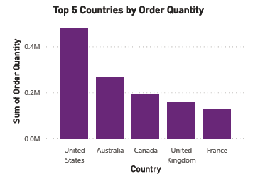
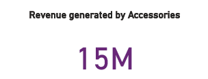
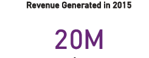
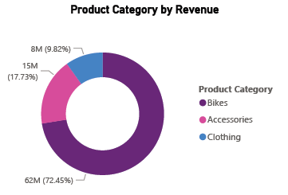
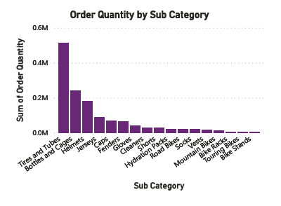
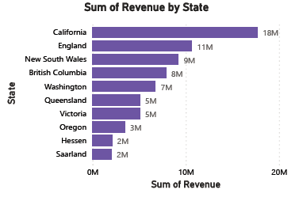

# Buy-Buy-Sales-Project

---
## Introduction
This is a Power BI project on sales data for a store called **Buy-Buy Store**. This project is to analyze and derive insights to answer critical questions and allow these insights/answers provided to be used to make better decisions going forward as a business.
**_Disclaimer_**: This dataset was gotten from my mentor for me to practice and build a dashboard using Power BI.

## Problem Statement
1.	What are the top 5 countries by order quantity?
2.	How much revenue was generated from accessory sales?
3.	How much revenue generated in 2015?
4.	What is the order quantity by gender?
5.	How much revenue generated by each product category?
6.	What is the order quantity for each product sub-category?
7.	What are the top 10 states by revenue generated?

## Skills and Concepts Demonstrated
The following Power BI features were incorporated: Bookmarking, DAX, Page navigation, New Measures, Modeling Filters.

## Modelling:
The dataset is just a table, so I did not do any modeling.

## Visualization
This report contains a single page.
You can interact with the report here (https://app.powerbi.com/groups/me/reports/bc9f8025-d380-419c-aedf-9a801d641b9c/ReportSection?experience=power-bi)

## Analysis
According to the analysis conducted on the Buy-Buy store data, the visual below shows the countries where the store had the most orders and the United States ranks first.

--
While $15m was the total revenue generated from accessory sales

--
In 2015, the store generated a total of $20M in total revenue

--
This visual below shows the order quantity by customer gender and the male customers has placed more orders (700k) than the female customers (646k).

--
For each product category, the bike products generated the most revenue with over $60m generated, while the clothing products generated the least revenue ($8m).

--
The product sub-category is ranked below based on the order quantity for each sub-category. The Tires and Tubes rank first and bike stands rank the least.

--
The top 10 states by revenue generated are shown below with California generating the most revenue ($18m).

--
## Conclusion:
Based on the comprehensive analysis of the buy-buy dataset, I have uncovered valuable insights into how best the store can maximize profit and make better decisions going forward. This data-driven approach has allowed us to identify trends and insights.

